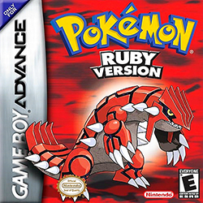
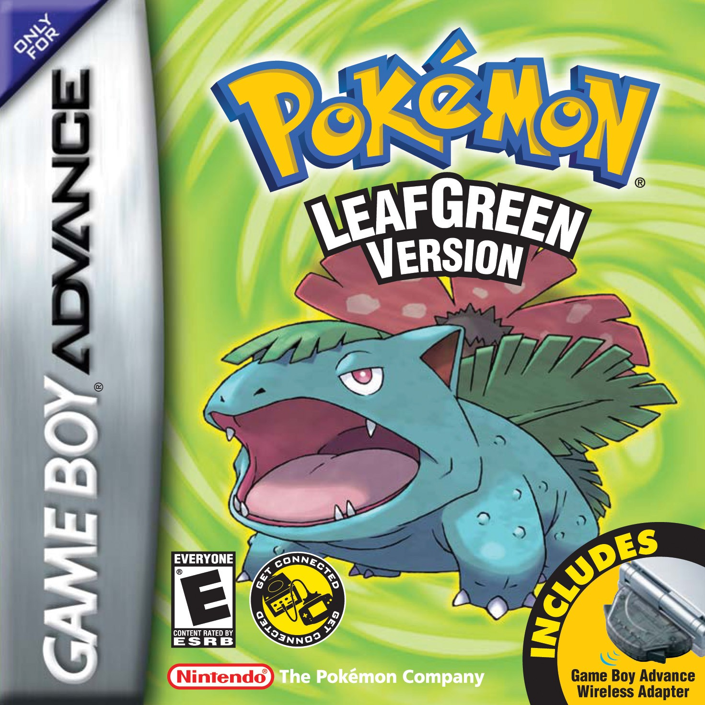

# sl4ckrr.github.io.
very coool website check it out.

- 150+ games
- JsEmulator
- TSOS | Alternnative Website Links
- Bypass blockers

# visit the site of sites

https://sl4ckrr.github.io./TSOS

# more games here:
- the sl4ckrr game library https://sl4ckrr.github.io./projects.html
- OvO Unblocked https://sl4ckrr.github.io./ovo
  

  

full of games and even our jsemulator:
just drop the file into the project and it will load the gba,gbc,gb wtv idc
  https://sl4ckrr.github.io./jsemulator

# sl4ckrr
follow my newgrouds for website updates and bug fixes!
(https://rhap5ody.newgrounds.com/)

other socals here:
- https://www.instagram.com/slac.krr?igsh=Y2U3eGVrZ2thMm5x&utm_source=qr
- https://www.tiktok.com/@sl4ckrr?_t=ZT-8tUPgOK3PEx&_r=1
- https://on.soundcloud.com/Cp6rTBxjCLhQWHtN9
- https://youtube.com/@rhap5ody?si=2YNkX1aeSM32qs1K

## what is this?
this is a fork of https://selenite.cc check out the website and its cool games!
## Contributors

Made with [contrib.rocks](https://contrib.rocks).
a really easy to use contributers README.md website!

## Support

Join the sl4ckrr [discord server](https://discord.gg/WDZhkdFyF4) for monthly new game pole(up to 15 new ones) and community.

Join R4e's [discord server](https://discord.gg/WDZhkdFyF4) idk for community, read rules and stuff.

# extras
not tryna profit off this website obviously its made by sky and just tryna improve website buildig and its fun when bored at school.
